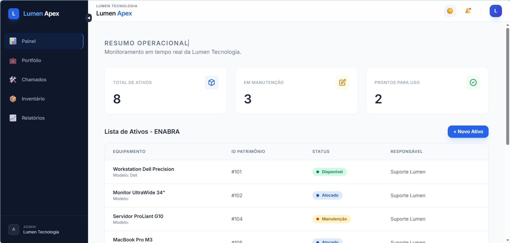
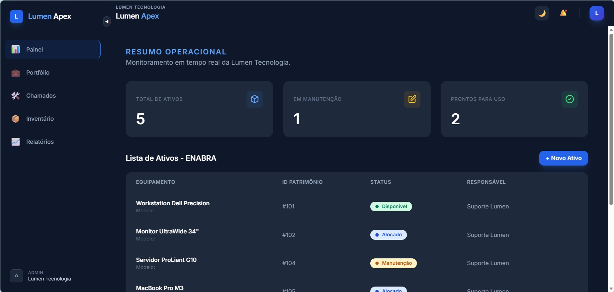
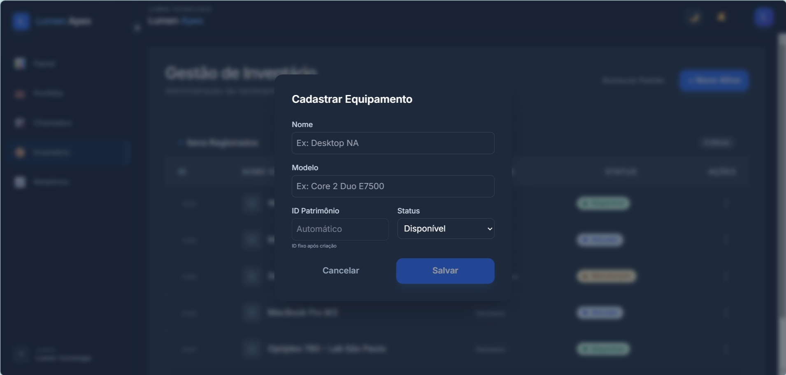
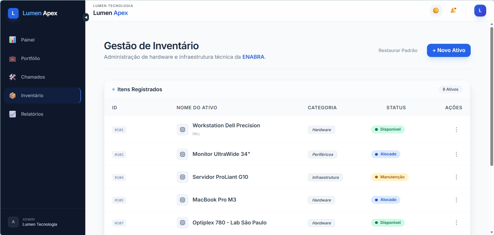

# Lumen Apex - Sistema de Gestão Tecnológica - PUC MVP - Frontend Avançado

## 📋 Sobre o Projeto

Projeto MVP da disciplina **Frontend Avançado** do curso **Desenvolvimento Full Stack** pela **PUC-RJ**. O projeto disponibiliza uma plataforma de monitoramento e gestão de ativos de TI, focada no suporte técnico e desenvolvimento.

## 🔗 Links Oficiais
*   **Repositório GitHub:** https://github.com/ledelmastro/lumen-apex
*   **Live Demo (GitHub Pages):** <a href="https://ledelmastro.github.io/lumen-apex/" target="_blank">
  
  <br>
  ▶️ <b>Clique aqui para abrir o Live Demo em uma nova aba</b>
</a>

## 📺 Demonstração em Vídeo
> **[Link para o vídeo no YouTube aqui]**  

---

## 📸 Screenshots
| Funcionalidade | Captura de Tela |
| :--- | :--- |
| **Dashboard** (Visão Geral - Modo Claro) |  |
| **Dashboard** (Visão Geral - Modo Escuro) |  |
| **Cadastro de Equipamentos** |  |
| **Gestão de Inventário** |  |

---

## ✨ Funcionalidades Principais

*   **Painel de Controle (Dashboard):** Visualização rápida de métricas operacionais e ativos recentes.
*   **Gestão de Inventário:** CRUD completo (Criação, Leitura, Atualização e Exclusão) de equipamentos com persistência automática via `LocalStorage`.
*   **Auditoria e Relatórios:** Listagem detalhada para conferência técnica com indicadores de saúde da frota.
*   **Sistema de Chamados:** Módulo dedicado para abertura e acompanhamento de suporte técnico.
*   **Modo Escuro (Dark Mode):** Interface adaptável que respeita a preferência do sistema operacional ou escolha manual do usuário.
*   **Design Responsivo:** Layout totalmente adaptável para dispositivos móveis, tablets e desktops.
*   **Feedback de UX:** Uso de *skeleton screens*, tooltips e mensagens contextuais para orientação do usuário.

---

## 🛠️ Tecnologias e Padrões

*   **Framework:** Angular 21 (Zoneless reatividade)
*   **Estado:** Signals, `computed()` e `effect()`
*   **Estilização:** Tailwind CSS (Mobile-first)
*   **Navegação:** Angular Router com suporte a rotas independentes e página 404
*   **Dados:** Simulação de servidor via arquivos JSON e persistência no navegador
*   **Acessibilidade:** Seguindo padrões WCAG AA e uso de atributos ARIA

---

## 🚀 Instruções de Instalação e Execução

Siga as etapas abaixo para configurar o ambiente local e executar o projeto.

### 1. Pré-requisitos
Certifique-se de ter instalado em seu computador:
*   Node.js (Versão 20.x ou superior recomendada)
*   NPM (Incluso no Node.js)

### 2. Configuração do Ambiente Local

Abra o seu terminal e execute os seguintes comandos:

1.  **Clonar o Repositório:**
    ```bash
    git clone https://github.com/ledelmastro/lumen-apex.git
    cd lumen-apex
    ```

2.  **Instalar Dependências:**
    Baixe todas as bibliotecas necessárias listadas no `package.json`:
    ```bash
    npm install
    ```

### 3. Executando a Aplicação

Para iniciar o servidor de desenvolvimento:
```bash
npm start
```
Após o comando, a aplicação estará disponível no endereço:  
👉 **http://localhost:4200**

---

## 📂 Estrutura de Pastas

A organização do projeto segue as melhores práticas do Angular para escalabilidade e separação de responsabilidades:

```text
src/app/
├── components/          # Componentes reutilizáveis de UI
│   ├── header/          # Cabeçalho, controles de tema e notificações
│   ├── sidebar/         # Navegação lateral responsiva e menu mobile
│   ├── status-badge/    # Etiquetas visuais de status (Disponível, etc)
│   └── summary-card/    # Cards de indicadores com suporte a skeleton
├── models/              # Definições de interfaces e tipos (TypeScript)
├── pages/               # Componentes de visualização principal (Páginas)
│   ├── chamados/        # Gestão de tickets e suporte técnico
│   ├── dashboard/       # Painel de controle operacional
│   ├── inventario/      # Gestão de ativos (CRUD completo)
│   ├── not-found/       # Página de erro 404 amigável
│   ├── perfil/          # Configurações e dados do usuário
│   └── relatorios/      # Relatórios de auditoria e métricas
├── services/            # Serviços de dados, lógica e persistência
├── app.html             # Estrutura de layout global (Layout Shell)
├── app.routes.ts        # Configuração centralizada de rotas
└── app.ts               # Componente raiz da aplicação
```

---
